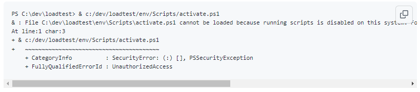
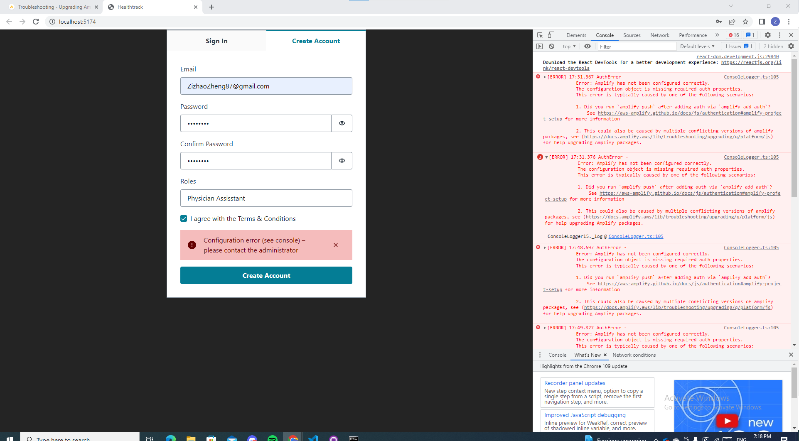

# HealthtrackV8
## Installation

Clone the front and backend project
```
please don't create a folder to git clone. Just clone repo to path. such as my folder: C:\Users\kenzh\Work,

git clone https://github.com/Dotechno/HealthtrackV8
cd HealthtrackV8

please when you amplify pull into folder, please amplify to HealthTracker V8 folder

amplify pull --appId dd1gmnh1dmpn6 --envName dev
```

Install yarn and run a dev server
```
npm install --global yarn
yarn install
yarn start
```

## Deployment
### Vscode not running script disable:


### Solution:
  1. open window powershell
  2. Set-ExecutionPolicy -ExecutionPolicy RemoteSigned -Scope CurrentUser
  3. Get-ExecutionPolicy
  4.Get-ExecutionPolicy -LIST

  Website: https://github.com/Microsoft/vscode-python/issues/2559

### Create an account:

Just put your email and strong Password generated from Google Chrome Password manager

If you have problem,

---------

### Error: Amplify has not been configure correctly.

        
        
### Solution: [Stackoverflow](https://stackoverflow.com/questions/63605779/autherror-error-amplify-has-not-been-configured-correctly#comment115783887_63605780)
    1. npm un aws-amplify @aws-amplify/ui-react
    2. npm i aws-amplify @aws-amplify/ui-react

 


